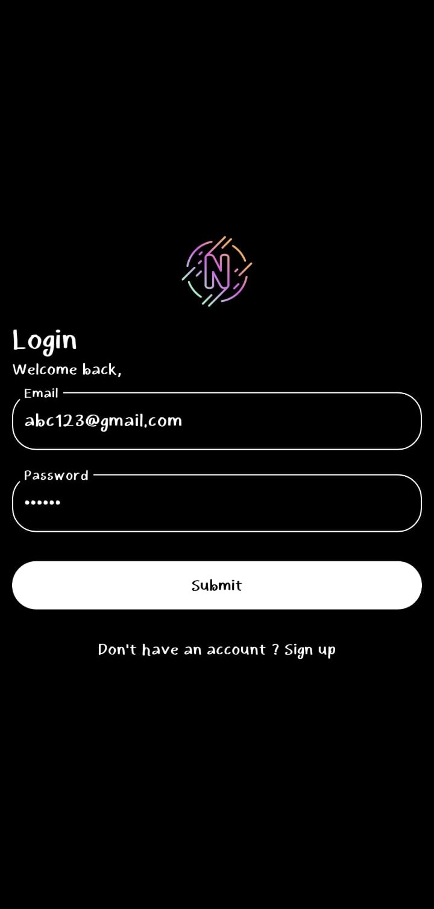
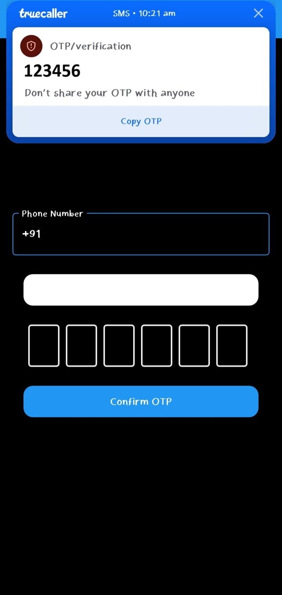
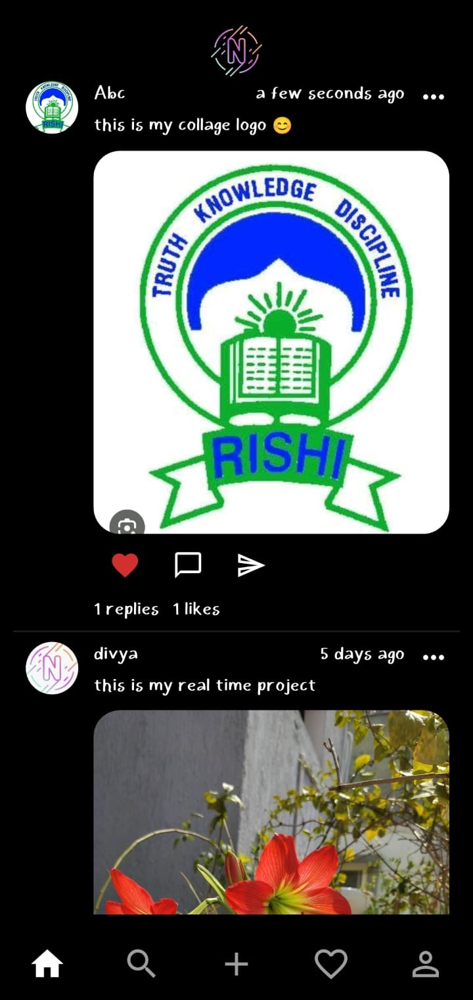

# 📱 NexCo – A Secure Social Media App using Flutter & Supabase

**NexCo** is a secure and lightweight social media application developed using **Flutter** for the frontend and **Supabase** as the backend service. This project demonstrates multi-factor authentication (MFA) through both **email-password login** and **OTP-based phone number verification**, offering a reliable and user-friendly experience. Built as part of a real-time academic project, NexCo prioritizes privacy, simplicity, and mobile-first design.

---

## 🔑 Key Features

- 📧 **Email Authentication** – Sign in securely with email and password
- 📲 **OTP Verification** – Login or register using mobile number and OTP (One-Time Password)
- 👤 **Profile Management** – Add and update name, profile photo, and bio
- 📝 **Post Creation** – Share thoughts with text and optional images
- 💬 **Engage with Content** – Like and comment on posts in real time
- 🌙 **Modern Dark UI** – Clean and responsive interface with dark theme

---

## 🛠️ Tech Stack

- **Frontend:** Flutter (Dart)
- **Backend-as-a-Service:** Supabase
- **Database:** PostgreSQL (via Supabase)
- **Authentication:** Supabase Auth (Email & OTP)
- **State Management:** GetX
- **OTP UI Input:** `flutter_otp_text_field`, `pinput`

---

## 📱 Screenshots

<p align="center">
  
  &nbsp;&nbsp;
  
  &nbsp;&nbsp;
  
</p>


---

## 🧪 How to Run the Project

1. **Clone the Repository**
```bash
git clone https://github.com/yourusername/nexco.git
cd nexco
```

2. **Install Dependencies**
```bash
flutter pub get
```

3. **Set Up Environment Variables**

Replace ur Supabase url and supabase key in `.env` file in the root directory:
```
SUPABASE_URL=your-supabase-url
SUPABASE_ANON_KEY=your-supabase-anon-key
```

4. **Run the App**
```bash
flutter run
```

---

## 📦 Dependencies Used

```yaml
cupertino_icons: ^1.0.8
get: ^4.7.2
get_storage: ^2.1.1
form_validator: ^2.1.1
flutter_dotenv: ^5.2.1
supabase_flutter: ^2.9.0
image_picker: ^1.1.2
flutter_image_compress: ^2.4.0
uuid: ^4.5.1
pinput: ^3.0.0
flutter_otp_text_field: ^1.1.0+2
jiffy: ^6.4.3
intl: ^0.20.2
```

---

## 🔐 Why Multi-Factor Authentication?

Instead of relying solely on passwords, NexCo implements:
- ✅ **Email Verification** – Ensures trusted access to the platform
- ✅ **Phone Number OTP Login** – Adds an extra layer of identity validation

This makes the app more secure and user-friendly, especially for mobile-first users.

---

## 🌱 Future Enhancements

- 🔒 Biometric authentication (Fingerprint/Face ID)
- 💬 Real-time chat system
- 🔔 In-app and push notifications
- 🌐 iOS and web app support
- 🧑‍💻 Admin dashboard for user/content moderation

---

## 👩‍💻 About the Developer

Hi, I'm **K. Kavya Sree**, a Computer Science Engineering student at **Rishi MS Institute of Engineering, Hyderabad**.  
This project is a practical implementation of what I’ve learned in mobile development, with a strong focus on user security and modern app architecture.

LinkedIn: linkedin.com/in/kavya-sree-katabathina-59a1731b3
GitHub: @Kavyasree2006
Email: katabathina1kavyasree@gmail.com

---

## 📚 References

- [Supabase Documentation](https://supabase.com/docs)
- [Flutter Documentation](https://flutter.dev)
- [Dart Language Tour](https://dart.dev/guides/language/language-tour)
- [PostgreSQL](https://www.postgresql.org/)
